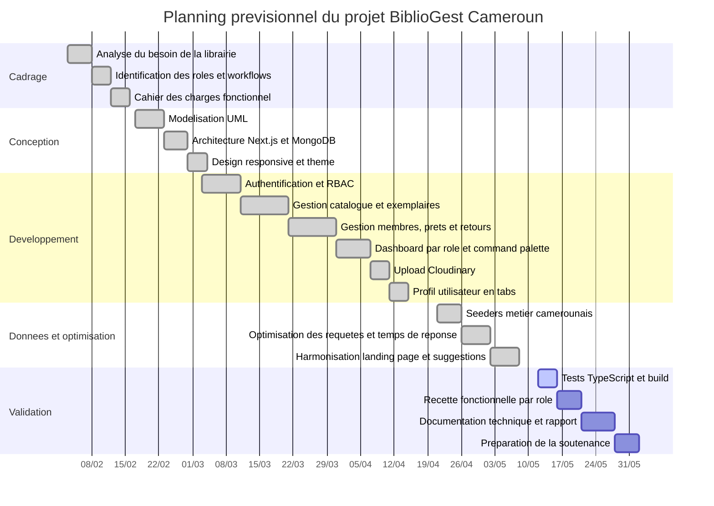

# Diagramme de Gantt

Ce planning resume les grandes phases du projet. Il peut etre adapte selon les dates exactes du stage.

## Lecture du planning

- Les phases de cadrage et conception posent le perimetre metier.
- Le developpement est organise par modules fonctionnels.
- La validation verifie les roles, les parcours utilisateur et la stabilite de l'application.
- La documentation sert de base au rapport de stage et a la soutenance.
