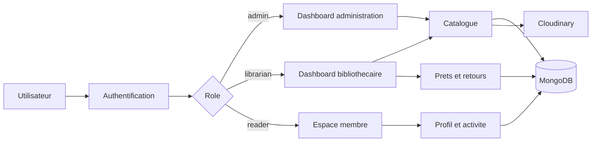

# Guide pour le rapport de stage

## Titre propose

Conception et realisation d'une application web de gestion de librairie/bibliotheque : cas de BiblioGest Cameroun.

## Contexte

Le projet repond au besoin d'une structure camerounaise souhaitant centraliser la gestion de son catalogue, de ses exemplaires, de ses membres, de ses prets et de ses retours. L'application n'est pas un SaaS public : elle est pensee comme un outil interne pour une librairie/bibliotheque avec plusieurs profils d'utilisation.

## Problematique

Comment concevoir une application web responsive, securisee et maintenable permettant a une librairie/bibliotheque de gerer efficacement ses operations quotidiennes tout en respectant les niveaux d'acces des utilisateurs ?

## Objectifs

- Mettre en place une authentification fiable avec gestion des roles.
- Gerer le catalogue : auteurs, editeurs, categories, genres, ouvrages et exemplaires.
- Gerer les membres, les prets, les retours et les retards.
- Proposer un dashboard adapte au role connecte.
- Permettre l'upload d'images via Cloudinary.
- Produire une base de donnees de demonstration coherente avec le contexte camerounais.
- Assurer une interface responsive et un theme clair/sombre coherent.

## Methodologie

Le projet suit une approche iterative :

1. Analyse du besoin et identification des acteurs.
2. Conception UML et architecture technique.
3. Developpement par modules fonctionnels.
4. Integration des roles et des controles d'acces.
5. Optimisation, responsive design et verification du theme.
6. Tests de build, validation fonctionnelle et documentation.

## Acteurs principaux

| Acteur | Responsabilites |
| --- | --- |
| Administrateur | Gestion globale, statistiques, configuration et supervision |
| Bibliothecaire | Gestion operationnelle du catalogue, des prets et des retours |
| Lecteur/Membre | Consultation de son profil, suivi des emprunts et informations personnelles |

## Modules de l'application

- Authentification et session utilisateur.
- Dashboard dynamique selon le role.
- Catalogue des ouvrages et exemplaires.
- Gestion des membres.
- Gestion des prets, retours et retards.
- Upload d'images Cloudinary.
- Profil utilisateur organise en tabs.
- Suggestions dynamiques selon l'activite et l'authentification.
- Theme clair/sombre avec adaptation globale.
- Statistiques admin avec graphiques Recharts, synthese de tendance et exports CSV/PDF.

## Architecture fonctionnelle

## Choix techniques justifies

- Next.js 16 permet de combiner rendu serveur, Server Actions et routes API.
- MongoDB convient a la structure documentaire du catalogue et des operations.
- Mongoose facilite la definition de schemas et relations applicatives.
- NextAuth v5 centralise la session et la securite.
- Cloudinary externalise le stockage et la diffusion des images.
- Tailwind CSS accelere la creation d'une interface responsive.
- Zod et React Hook Form fiabilisent la saisie utilisateur.

## Resultats attendus

- Une application exploitable par une librairie/bibliotheque locale.
- Une navigation differenciee selon le role connecte.
- Des operations courantes plus rapides : recherche, pret, retour, suivi.
- Des indicateurs visuels plus lisibles pour analyser les livres, auteurs, categories, genres et editeurs.
- Une base de donnees initiale representative du contexte local.
- Une documentation technique et UML reutilisable pour la maintenance.

## Limites et perspectives

- Ajouter un module de notifications avancees par email ou SMS.
- Integrer des recommandations IA reelles via un service externe.
- Ajouter des rapports statistiques exportables plus detailles.
- Prevoir un module d'inventaire physique et codes-barres.
- Renforcer les tests automatises end-to-end.

## Annexes conseillees

- Captures d'ecran de la landing page et des dashboards.
- Diagrammes UML du dossier `docs/uml`.
- Diagramme de Gantt du dossier `docs/stage/gantt.md`.
- Extraits de code : Server Action, schema Mongoose, controle RBAC, upload Cloudinary.
- Cahier de recette fonctionnelle.
