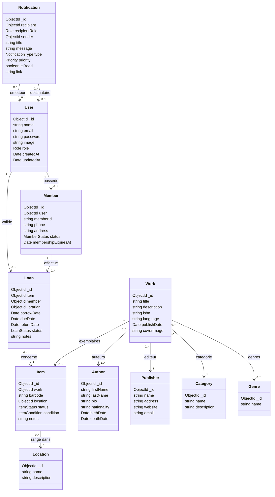

# Diagramme de classes

```mermaid
classDiagram
  class User {
    ObjectId _id
    string name
    string email
    string password
    string image
    Role role
    Date createdAt
    Date updatedAt
  }

  class Member {
    ObjectId _id
    ObjectId user
    string memberId
    string phone
    string address
    MemberStatus status
    Date membershipExpiresAt
  }

  class Work {
    ObjectId _id
    string title
    string description
    string isbn
    string language
    Date publishDate
    string coverImage
  }

  class Item {
    ObjectId _id
    ObjectId work
    string barcode
    ObjectId location
    ItemStatus status
    ItemCondition condition
    string notes
  }

  class Loan {
    ObjectId _id
    ObjectId item
    ObjectId member
    ObjectId librarian
    Date borrowDate
    Date dueDate
    Date returnDate
    LoanStatus status
    string notes
  }

  class Author {
    ObjectId _id
    string firstName
    string lastName
    string bio
    string nationality
    Date birthDate
    Date deathDate
  }

  class Publisher {
    ObjectId _id
    string name
    string address
    string website
    string email
  }

  class Category {
    ObjectId _id
    string name
    string description
  }

  class Genre {
    ObjectId _id
    string name
  }

  class Location {
    ObjectId _id
    string name
    string description
  }

  class Notification {
    ObjectId _id
    ObjectId recipient
    Role recipientRole
    ObjectId sender
    string title
    string message
    NotificationType type
    Priority priority
    boolean isRead
    string link
  }

  User "1" --> "0..1" Member : possede
  Member "1" --> "0..*" Loan : effectue
  User "1" --> "0..*" Loan : valide
  Work "1" --> "0..*" Item : exemplaires
  Work "0..*" --> "1" Publisher : editeur
  Work "0..*" --> "1" Category : categorie
  Work "0..*" --> "0..*" Genre : genres
  Work "0..*" --> "1..*" Author : auteurs
  Item "0..*" --> "1" Location : range dans
  Loan "0..*" --> "1" Item : concerne
  Notification "0..*" --> "0..1" User : destinataire
  Notification "0..*" --> "0..1" User : emetteur
```
