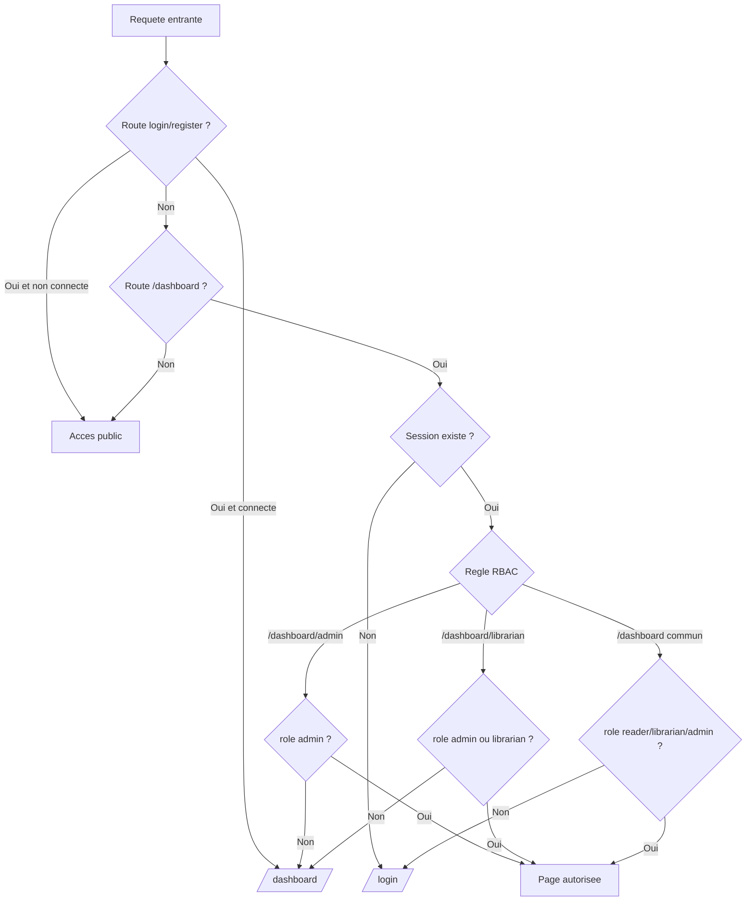

# Diagramme RBAC

```mermaid
flowchart TD
  Request[Requete entrante] --> IsAuthPage{Route login/register ?}
  IsAuthPage -- Oui et connecte --> Dashboard[/dashboard/]
  IsAuthPage -- Oui et non connecte --> PublicAccess[Acces public]
  IsAuthPage -- Non --> IsDashboard{Route /dashboard ?}

  IsDashboard -- Non --> PublicAccess
  IsDashboard -- Oui --> Logged{Session existe ?}
  Logged -- Non --> Login[/login/]
  Logged -- Oui --> Rule{Regle RBAC}

  Rule -- /dashboard/admin --> AdminOnly{role admin ?}
  Rule -- /dashboard/librarian --> StaffOnly{role admin ou librarian ?}
  Rule -- /dashboard commun --> MemberArea{role reader/librarian/admin ?}

  AdminOnly -- Oui --> Allow[Page autorisee]
  AdminOnly -- Non --> Dashboard
  StaffOnly -- Oui --> Allow
  StaffOnly -- Non --> Dashboard
  MemberArea -- Oui --> Allow
  MemberArea -- Non --> Login
```
