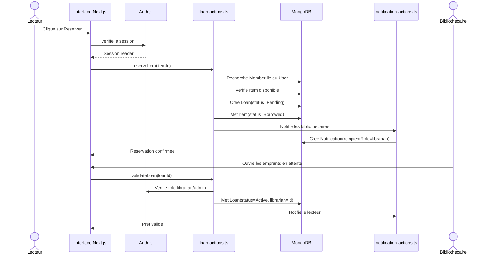

# Diagramme de sequence - reservation et validation

```mermaid
sequenceDiagram
  actor Reader as Lecteur
  participant UI as Interface Next.js
  participant Auth as Auth.js
  participant LoanAction as loan-actions.ts
  participant DB as MongoDB
  participant Notify as notification-actions.ts
  actor Librarian as Bibliothecaire

  Reader->>UI: Clique sur Reserver
  UI->>Auth: Verifie la session
  Auth-->>UI: Session reader
  UI->>LoanAction: reserveItem(itemId)
  LoanAction->>DB: Recherche Member lie au User
  LoanAction->>DB: Verifie Item disponible
  LoanAction->>DB: Cree Loan(status=Pending)
  LoanAction->>DB: Met Item(status=Borrowed)
  LoanAction->>Notify: Notifie les bibliothecaires
  Notify->>DB: Cree Notification(recipientRole=librarian)
  LoanAction-->>UI: Reservation confirmee

  Librarian->>UI: Ouvre les emprunts en attente
  UI->>LoanAction: validateLoan(loanId)
  LoanAction->>Auth: Verifie role librarian/admin
  LoanAction->>DB: Met Loan(status=Active, librarian=id)
  LoanAction->>Notify: Notifie le lecteur
  LoanAction-->>UI: Pret valide
```
