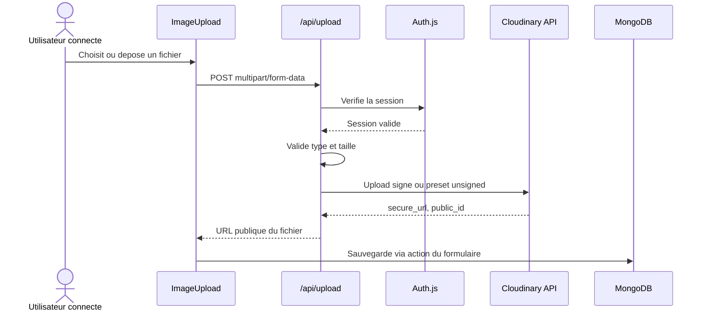

# Diagramme de sequence - upload Cloudinary

```mermaid
sequenceDiagram
  actor User as Utilisateur connecte
  participant Upload as ImageUpload
  participant API as /api/upload
  participant Auth as Auth.js
  participant Cloudinary as Cloudinary API
  participant DB as MongoDB

  User->>Upload: Choisit ou depose un fichier
  Upload->>API: POST multipart/form-data
  API->>Auth: Verifie la session
  Auth-->>API: Session valide
  API->>API: Valide type et taille
  API->>Cloudinary: Upload signe ou preset unsigned
  Cloudinary-->>API: secure_url, public_id
  API-->>Upload: URL publique du fichier
  Upload->>DB: Sauvegarde via action du formulaire
```
